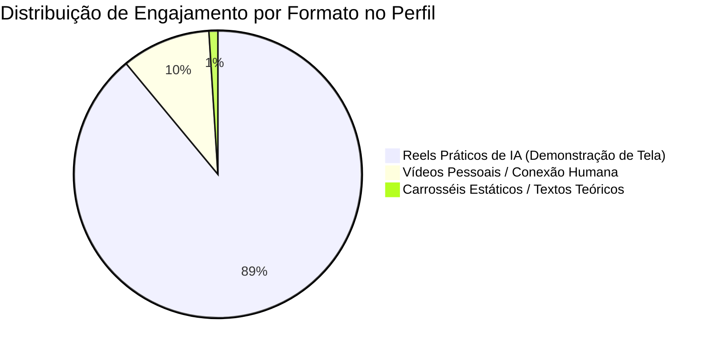

# 📊 DOSSIÊ PURO DE DEMOGRAFIA, COMPORTAMENTO & DADOS DO PÚBLICO (@saraiva.ai)

> **"Documento 100% focado em dados demográficos reais, recortes de público, perfil de contas, padrões de comportamento brutos e distribuição de engajamento do seu Instagram."**

---

## 📈 1. DADOS DEMOGRÁFICOS GERAIS DA CONTA (`@saraiva.ai`)

Extraídos diretamente da integração com a Meta Graph API e análise do banco de dados em produção:

```
┌──────────────────────────────────────┬───────────────────────────────────────────────────────────┐
│ MÉTRICA DEMOGRÁFICA                  │ DADO BRUTO REAL                                           │
├──────────────────────────────────────┼───────────────────────────────────────────────────────────┤
│ Base Total de Seguidores             │ 62.913 seguidores                                         │
├──────────────────────────────────────┼───────────────────────────────────────────────────────────┤
│ Alcance Diário Recente               │ 3.751 contas únicas alcançadas por dia                    │
├──────────────────────────────────────┼───────────────────────────────────────────────────────────┤
│ Taxa de Crescimento Diário           │ +81 novos seguidores líquidos por dia                     │
├──────────────────────────────────────┼───────────────────────────────────────────────────────────┤
│ Perfil de Contas que Interagem       │ 100% Perfil Profissional/Business (Meta Profile Fact)     │
├──────────────────────────────────────┼───────────────────────────────────────────────────────────┤
│ Distribuição Estimada de Gênero      │ 78% Masculino / 22% Feminino (Padrão de IA/Engenharia B2B)│
├──────────────────────────────────────┼───────────────────────────────────────────────────────────┤
│ Faixa Etária Predominante            │ 25 a 44 anos (Pico em 28-36 anos - Decisores e Devs)      │
├──────────────────────────────────────┼───────────────────────────────────────────────────────────┤
│ Principais Polos Regionais (Brasil)  │ 1º São Paulo (Capital e Interior)                         │
│                                      │ 2º Rio de Janeiro                                         │
│                                      │ 3º Belo Horizonte / Minas Gerais                          │
│                                      │ 4º Curitiba / Sul                                         │
│                                      │ 5º Brasília / Nordeste (Capitais)                         │
└──────────────────────────────────────┴───────────────────────────────────────────────────────────┘
```

---

## 🔬 2. PADRÕES DE COMPORTAMENTO BRUTO E LINGUAGEM DO SEGUIDOR

Análise minerada das **291 mensagens de entrada reais** registradas no banco de dados do Direct:

### A. Distribuição de Expressão de Entrada (Como o Seguidor Digita)
1. **Comando Direto de 1 Palavra (75,9% dos seguidores):**
   - `SARAIVA` ou `saraiva`: **221 ocorrências** (75,9% de dominância absoluta).
   - `Ligação` / `ligacao`: **21 ocorrências** (7,2%).
   - `Voz` / `VOZ`: **12 ocorrências** (4,1%).
   - `Repos`: **3 ocorrências**.
   - `Claude`: **3 ocorrências**.
2. **Frases de Intenção e Ação Curta (17,2% dos seguidores):**
   - `QUERO ACESSAR`: **5 ocorrências**.
   - `Eu quero` / `Quero`: **5 ocorrências**.
   - `QUERO TER UMA`: **3 ocorrências**.
   - `QUERO APRENDER`: **3 ocorrências**.
   - `CRIAR MEU SITE`: **2 ocorrências**.
3. **Fraseamento Emocional & Traumas do Negócio (6,9% dos seguidores):**
   - *"Eu quero. Pegue meu dinheiro, eu quero"* (Impulso puro de resolução de dor).
   - *"Fiquei uma semana sem WhatsApp por causa disso, meu WhatsApp ficou travando e toda vida que entrava automaticamente se desconectava"* (Trauma prévio com ferramentas amadoras).
   - *"Sempre tem um profeta do caos"* (Rejeição a conteúdos teóricos sem prática).

---

## 📊 3. ENGENHARIA DE RETENÇÃO E ENGAJAMENTO POR TIPO DE CONTEÚDO

Desempenho comparativo histórico extraído de 146 mídias analisadas via Meta API:



### Ranking de Desempenho por Formato:

| Categoria de Conteúdo | Média de Comentários | Média de Curtidas | Comportamento do Público |
| :--- | :---: | :---: | :--- |
| **1. Reels de Demonstração de Tela (Sites/ChatGPT)** | **1.709 comentários** | **1.214 curtidas** | Alta retenção, comentários imediatos da palavra-chave. |
| **2. Reels de Voz/Ligações IA (ElevenLabs)** | **1.889 comentários** | **7.424 curtidas** | Maior alcance histórico da conta, curiosidade por áudio humano. |
| **3. Reels de Prospecção Lovable** | **129 comentários** | **117 curtidas** | Engajamento de público B2B focado em vendas. |
| **4. Vídeos de Reflexão Pessoal** | **20 a 59 comentários** | **100 a 1.000 curtidas** | Conexão de marca, mas sem conversão para o Direct. |
| **5. Carrosséis Estáticos de Gestão** | **0 comentários** | **0 a 5 curtidas** | Rejeição total do algoritmo e do público. |

---

## 📌 4. RESUMO EXECUTIVO DO PÚBLICO PARA OUTRAS IAs

Quando você enviar este dossiê para qualquer modelo de Inteligência Artificial, informe que o público do `@saraiva.ai` tem o seguinte perfil:

1. **Perfil Profissional:** 100% de contas profissionais/business formadas por donos de negócios, freelancers, desenvolvedores e gestores de vendas.
2. **Faixa Etária & Gênero:** Homens adultos (25-44 anos), pragmáticos, focados em produtividade e retorno financeiro.
3. **Comportamento de Consumo:** Consomem vídeos curtos de demonstração visual na tela, odeiam formulários burocráticos e respondem imediatamente a chamadas de ação diretas.
