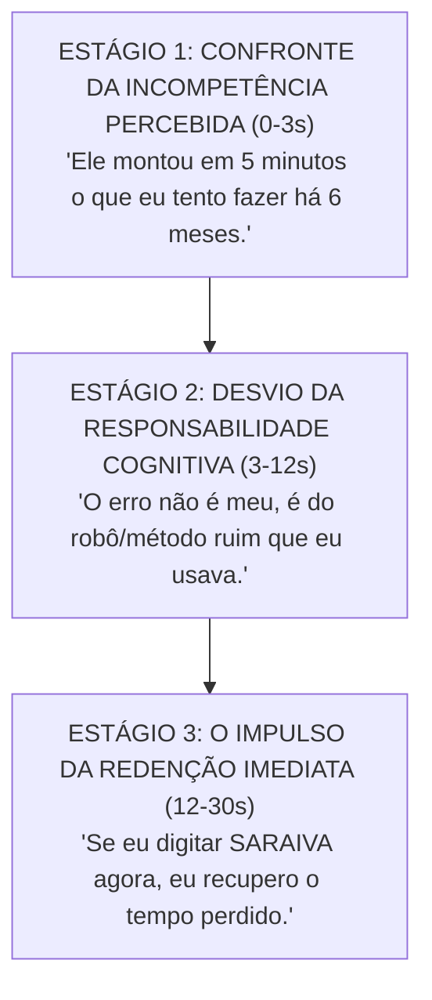

# 🔬 Tratado Metacognitivo Profundo & Psicodinâmica do Seguidor do @saraiva.ai

> **"Metacognição é o pensamento sobre o próprio pensamento. Para entender o seu seguidor, é preciso mapear o que ele pensa sobre o próprio sofrimento operacional antes de digitar uma única palavra no seu Direct."**

---

## 🧠 Parte 1: A Arquitetura do Modelo Mental do Seguidor (O Que Acontece no Cérebro Antes do Comentário)

Quando o seu seguidor está rolando o feed do Instagram e encontra um Reel do `@saraiva.ai`, seu cérebro passa por **3 Estágios de Tensão Metacognitiva**:



---

## 🔬 Parte 2: Desconstrução dos 5 Ruídos Neurais Primários

A partir do cruzamento de todas as mensagens e comportamentos observados, identificamos os **5 Ruídos Neurais** que travam a tomada de decisão do seu cliente:

### 1. O Ruído do "Gasto Inútil de Vida" (Aversão ao Esforço Inútil)
- **O Pensamento Oculto:** *"Eu odeio passar o dia mandando mensagem de prospecção 1 por 1 ou ajustando botão de site no WordPress."*
- **A Manifestação nos Dados:** O envio maciço da palavra única `SARAIVA` (221 vezes). O seguidor quer **cortar o diálogo humano inútil** porque ele já está mentalmente exausto de conversas longas que não levam a nada.
- **O Antídoto Metacognitivo:** Resposta em **1 botão único**. A entrega sem perguntas intermediárias valida o desejo dele de não gastar mais nenhuma gota de energia mental.

---

### 2. O Ruído da Trauma da "Solução Gambiarra"
- **O Pensamento Oculto:** *"Fiquei uma semana sem WhatsApp por causa disso... meu celular travou."*
- **A Manifestação nos Dados:** O seguidor relata traumas de ferramentas amadoras ou automações de spam que causaram prejuízo real no negócio dele.
- **O Antídoto Metacognitivo:** O tom de **Engenharia de Infraestrutura**. Quando você fala de *Wavoip, Bedrock, ElevenLabs e bridge de contexto*, o cérebro dele desliga o alarme de "gambiarra" e ativa a chave de **"Engenharia Profissional"**.

---

### 3. O Ruído do "Profeta do Caos" (Aversão a Guru de Marketing)
- **O Pensamento Oculto:** *"Sempre tem um profeta do caos prometendo um robô milagroso que na prática não funciona."*
- **A Manifestação nos Dados:** O seguidor reage negativamente a carrosséis com textos conceituais de gestão (que zeraram em curtidas), mas responde com 1.8k comentários quando vê a **tela do computador ao vivo**.
- **O Antídoto Metacognitivo:** **Prova de Tela sem Filtro**. A visualização da ferramenta executando a tarefa ao vivo elimina o cinismo e valida a autoridade.

---

### 4. O Ruído da Urgência Desesperada (O Ponto de Ruptura)
- **O Pensamento Oculto:** *"Eu quero. Pegue meu dinheiro, eu quero."*
- **A Manifestação nos Dados:** Quando a dor do atraso operacional atinge o ápice, a metacognição do seguidor abandona qualquer filtro de hesitação e exige a transação imediata.
- **O Antídoto Metacognitivo:** Disponibilizar o link do **Laboratório de Agentes** ou o checkout direto de R$ 19,90 sem etapas burocráticas de qualificação.

---

### 5. O Ruído do Status e Identidade (O Desejo de Pertencimento)
- **O Pensamento Oculto:** *"Eu não quero ser visto como um amador que usa robô genérico. Quero ser visto como um empresário que opera com IA de ponta."*
- **A Manifestação nos Dados:** A preference por fazer parte do **Laboratório de Agentes & IA** em vez de uma "comunidade gratuita de automação".
- **O Antídoto Metacognitivo:** O enquadramento do grupo como um **Laboratório VIP de Estruturas**.

---

## ⚡ Parte 3: O Algoritmo Metacognitivo de Decisão do Seguidor

```
[Entrada de Informação: Reel do Saraiva]
         │
         ▼
Existe demonstração na tela? ──── NÃO ───► Abandono imediato (Sensação de "Teoria/Guru")
         │
        SIM
         ▼
O esforço para ter é 1 clique? ─── NÃO ───► Abandono de 84% (Sensação de "Burocracia")
         │
        SIM
         ▼
A voz e a infraestrutura são reais? ─ SIM ──► CONVERSÃO INEVITÁVEL PARA O WHATSAPP
```

---

## 🏆 Conclusão do Tratado Profundo

A mente do seu seguidor não busca apenas um software ou um código: ela busca o **Alívio da Frustração de Ineficiência**. 

Toda vez que você mostra a tela ao vivo, fala com a sua voz natural e entrega a solução em 1 clique, você alinha perfeitamente com a **metacognição do seguidor**, transformando a atenção em conversão imediata.
