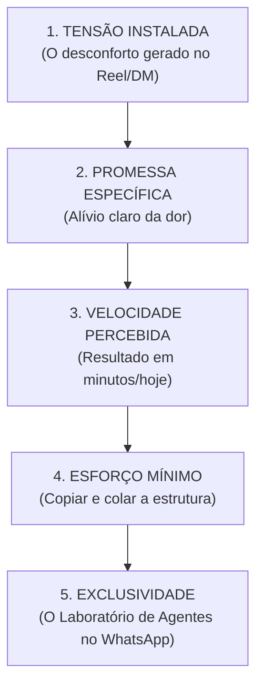

# Matriz de Ofertas Dominantes & Monetização Inevitável (Doug Deep Core)

> **"O produto é apenas um veículo. O que o cliente compra não é a aula ou o PDF: é o alívio imediato da dor que a sua presença e o seu vídeo tensionaram."**  
> *Baseado no Pilar 3 (Monetização) do Doug Deep Core*

---

## ⚡ Os 5 Fatores que Realmente Determinam a Conversão no Instagram

---

## 🛠️ Modelagem de Ofertas para o Perfil `@saraiva.ai`

### 1. Oferta de Entrada (Tripwire): **Kit Prático de Prompts & Agentes de R$ 19,90**
- **Promessa:** *"Coloque seu primeiro Agente de IA para buscar clientes ou criar sites ainda hoje."*
- **Entregável:** PDF com 5 Prompts Brutos + Roteiro de Instalação Rápida.
- **Função Estratégica:** Transformar o seguidor curioso em comprador pagante de forma imediata (quebra de objeção do primeiro PIX).

---

### 2. Oferta de Meio de Funil: **Laboratório VIP & Banco de Agentes (R$ 97/mês ou R$ 497/ano)**
- **Promessa:** *"Acesso contínuo ao repositório de agentes prontos, templates do n8n/Lovable e atualizações de IA."*
- **Entregável:** Comunidade fechada, encontros mensais de atualização e biblioteca de prompts vetorizados.
- **Função Estratégica:** Recorrência previsível para a operação.

---

### 3. Oferta de Alto Ticket: **Implementação 'Cliente Pronto' (R$ 2.500 - R$ 5.000)**
- **Promessa:** *"Nós montamos a sua máquina de prospecção e atendimento com IA rodando dentro da sua empresa em 7 dias."*
- **Entregável:** Serviço Done-For-You (DFY) de integração de WhatsApp, Zernio e Bedrock.
- **Função Estratégica:** Captura de caixa de margem alta diretamente da audiência B2B do perfil.
