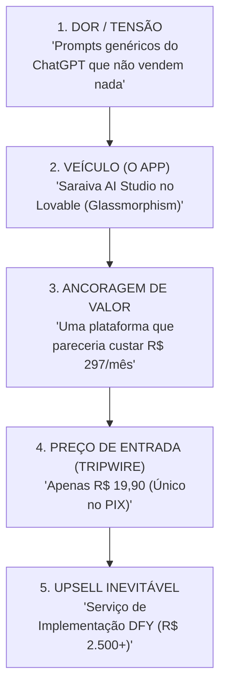

# 🏛️ ESTRUTURAÇÃO MESTRE DA OFERTA: SARAIVA AI STUDIO (R$ 19,90)

> **Engenharia de Oferta de Alta Conversão baseada na Metodologia Doug Deep Core & Psicologia de Compra Imediata.**

---

## 📐 1. A Matriz de Tensão & Entrega

---

## 📦 2. Os 4 Pilares Inclusos na Entrega (O Que o Cliente Leva)

### 🔹 Pilar 1: O Acesso à Plataforma Web (Saraiva AI Studio)
- **O que é:** Link direto de acesso ao Web App no Lovable (design de vidro claro, responsivo para celular e PC).
- **Sem Fricção:** Não precisa de cadastro complexo ou download de arquivos pesados. Clicou, usou.

### 🔹 Pilar 2: Os 5 Agentes de Pronta Resposta (Engenharia de Prompt Bruta)
- **Agente 1 (SDR Outbound B2B):** Prospecta clientes no Google Maps e Instagram com mensagens curtas que geram reuniões.
- **Agente 2 (Triador de Atendimento WhatsApp):** Ouve a dor do cliente, qualifica o orçamento e direciona para o PIX/Agendamento.
- **Agente 3 (Roteirista de Engenharia Social):** Cria roteiros de Reels em 4 blocos de alta retenção.
- **Agente 4 (Engenheiro de Ofertas Irresistíveis):** Monta a cópia de vendas e a promessa principal do seu produto.
- **Agente 5 (Fechador de Alto Ticket):** Contorna as 3 maiores objeções ("tá caro", "vou ver com o sócio", "depois te aviso").

### 🔹 Pilar 3: O Motor de Customização em 1 Clique
- O cliente preenche 3 campos na tela: `[Sua Empresa]`, `[Seu Produto]`, `[Seu Preço]`.
- O App reescreve todo o código do Agente em tempo real.
- Botão **`COPIAR PROMPT`** para colar direto no ChatGPT, Claude ou n8n.

### 🔹 Pilar 4: O Simulador ao Vivo de Respostas (Sandbox)
- Janela de teste onde o cliente simula a conversa com o Agente criado antes de levar para a empresa dele.

---

## 📢 3. Estrutura do Roteiro de Vendas (Copy em 4 Blocos para Reels & WhatsApp)

### 🔴 Bloco 1: O Hook de Confronto (0 - 3s)
> *"Se você ainda está usando o ChatGPT escrevendo 'aja como um especialista de marketing', você está jogando dinheiro e tempo no lixo."*

### 🟡 Bloco 2: A Demonstração de Tela (3 - 12s)
> *(Mostra a tela do Saraiva AI Studio no Lovable flutuando em modo claro).*  
> *"Eu criei uma plataforma chamada Saraiva AI Studio. Você clica no tipo de Agente que quer, digita o seu produto e ele te entrega a Engenharia de Prompt Bruta com o botão de copiar."*

### 🟢 Bloco 3: A Quebra de Objeção (12 - 22s)
> *"Sem PDF chato de 50 páginas. É uma ferramenta web direta, pronta para usar no celular ou no computador em menos de 3 minutos."*

### 🔵 Bloco 4: A Chamada de Ação com Escassez (22 - 30s)
> *"Eu liberarei o passe de acesso vitalício por apenas R$ 19,90 no PIX para os 100 primeiros. Comente **SARAIVA** aqui no vídeo que eu te mando o link direto no Direct."*

---

## 🚀 4. A Esteira de Monetização Inevitável (Como isso te gera caixa alto)

| Etapa | Produto | Preço | Objetivo Estratégico |
| :--- | :--- | :--- | :--- |
| **Entrada** | **Saraiva AI Studio (Lovable)** | **R$ 19,90** *(Pagamento Único)* | Pagar o tráfego e filtrar compradores reais de seguidores curiosos. |
| **Meio de Funil** | **Laboratório Saraiva (Comunidade)** | **R$ 97/mês** ou **R$ 497/ano** | Recorrência com novos prompts e automações semanais. |
| **Alto Ticket** | **Implementação 'Done-For-You'** | **R$ 2.500 a R$ 5.000** | Sua equipe constrói e conecta a IA no WhatsApp do cliente. |

---

## 🛠️ 5. Lista de Tarefas de Execução Imediata

1. [ ] **Publicar o App no Lovable:** Colar o prompt de design Light Glassmorphic e clicar em `Publish`.
2. [ ] **Criar o Checkout de R$ 19,90:** Cadastrar o produto na Kiwify/Hotmart com entrega automática do link do App.
3. [ ] **Configurar a Automação do Instagram:** Atualizar o respondedor no Direct para enviar o link do checkout quando comentarem `SARAIVA`.
4. [ ] **Gravar o Reel de Demonstração:** Gravar a tela do App funcionando com o script de 4 blocos.
