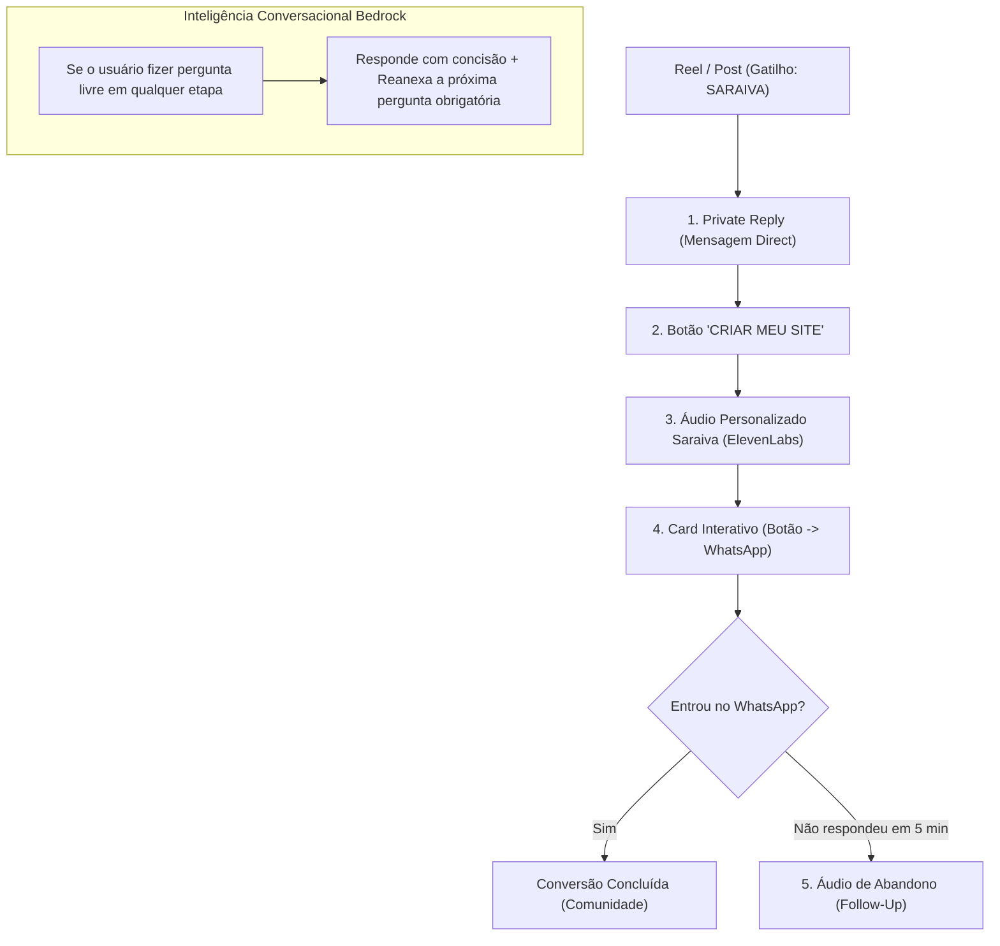

# Relatório Estratégico & Dissecação Neural — Jornada Completa do Instagram

> **"A maioria das automações morre não por falha técnica, mas por anomia emocional. Se a jornada não instala desconforto com o estado atual, a conversa vira só barulho."**  
> *Auditoria Geral da Arquitetura de Atendimento & Conversão via Doug Deep Core v20250520*

---

## 🗺️ Visão Geral da Jornada Completa de Atendimento

Mapeei todas as engrenagens da sua automação atual (desde o comentário inicial até a recuperação por abandono e o Bedrock AI):

---

## 🔬 Autópsia por Ponto de Contato (Doug Deep Core)

### 1. Ponto de Contato: Private Reply (Abertura no Direct)
- **Atual:** `"Vi seu comentário 👀 Vou te mostrar como criar um site profissional com o ChatGPT..."`
- **Diagnóstico Doug Core:** É polido e educado demais. Soa como um bot genérico tentando vender um curso.
- **Aprimoramento Recomendado:**
  > *"Você comentou SARAIVA porque sabe que seu site atual (ou a falta dele) é um RALO de clientes. Clica no botão abaixo e veja como virar esse jogo em minutos."*

---

### 2. Ponto de Contato: Áudio Principal (Dissecação Neural + Convite)
- **Atual (Já atualizado na etapa anterior):**
  > *"{Nome}, a maioria passa semanas apanhando do WordPress ou pagando caro por um site que não converte ninguém. O que eu vou te mostrar no WhatsApp não é historinha, é o prompt-base e a estrutura exata do @Sites pra colocar um site profissional rodando hoje. Entra no botão e pega o mapa antes que você perca mais clientes pro seu concorrente. Faz sentido pra você?"*
- **Diagnóstico Doug Core:** Excelente! Instala a frustração autêntica com o WordPress/agências lentas e oferece alívio imediato no botão.

---

### 3. Ponto de Contato: Áudio de Abandono (`abandonmentFollowUp.ts`)
- **Regra Atual:** Se o lead ficar **5 minutos sem responder/clicar**, o sistema envia um áudio de retomada.
- **Script Atual:** `"Passei rapidinho porque você pediu o passo a passo para criar seu site com o ChatGPT. Toque em CRIAR MEU SITE e eu te levo direto..."`
- **Diagnóstico Doug Core:** Faltou a **pressão por não-ação**. Deixar a conversa parada deve ser encarado como perder dinheiro.
- **Aprimoramento Recomendado para o Áudio de Abandono:**
  > *"{Nome}, passei aqui porque você pediu a estrutura e travou. Deixar isso pra depois é continuar perdendo cliente todo dia por não ter um site rodando. Clica no botão que deixei aí e pega a estrutura no WhatsApp de uma vez. Faz sentido pra você?"*

---

### 4. Ponto de Contato: Respostas Livres com Bedrock AI (`conversationalFlow.ts`)
- **Comportamento Atual:** Se o lead digita *"Como funciona?"* ou *"Quanto custa?"*, o Bedrock responde em até 260 caracteres e reanexa o botão ou próxima pergunta.
- **Direcionamento Doug Core:** A IA conversacional não deve "explicar" demais. Explicar reduz a tensão. Ela deve dar uma resposta **declarativa de 1 frase** e cobrar o clique no botão imediatamente.

---

## 🛠️ Plano de Ação Recomendado para Próximos Passos:

1. **Atualizar Script de Abandono:** Refazer o script em [`src/instagram/abandonmentFollowUp.ts`](file:///Users/saraiva/_Projetos/respondedorinstagram/src/instagram/abandonmentFollowUp.ts#L49-L55) com a linguagem do Doug Core.
2. **Afinar Prompts do Bedrock AI:** Ajustar o contexto confioso em [`src/instagram/conversationalFlow.ts`](file:///Users/saraiva/_Projetos/respondedorinstagram/src/instagram/conversationalFlow.ts#L36-L50) para ser brutalmente declarativo.
