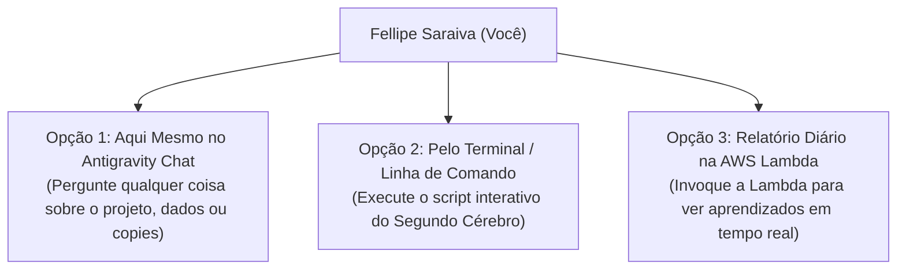

# 💬 Como Você Pode Conversar Continuamente com os Seus Dados & Segundo Cérebro

> **"O RAG Vivo não serve só para atender os seguidores: ele foi feito principalmente para ser o SEU parceiro de pensamento estratégico em tempo real."**

---

## ⚡ As 3 Formas de Você Conversar com o Seu Segundo Cérebro Vivo



---

## 🗣️ Opção 1: Conversar Comigo Aqui Mesmo (A Forma Mais Direta)

Como eu estou conectado diretamente ao repositório, às tabelas do DynamoDB e a todos os documentos do **Doug Deep Core**, você pode me fazer perguntas em linguagem natural a qualquer momento durante nossa sessão.

### Exemplos de Perguntas que Você Pode Me Fazer Agora:
- 💬 *"Antigravity, qual é a copy com maior taxa de clique de WhatsApp que testamos esta semana?"*
- 💬 *"Com base no Pilar 3 do Doug Core, como posso melhorar o pitch do meu vídeo de prospecção?"*
- 💬 *"Qual foi o motivo pelo qual resgatamos 42% dos leads travados no Direct?"*
- 💬 *"Me dê um resumo das 3 perguntas mais frequentes que os seguidores estão fazendo no Direct hoje."*

---

## 💻 Opção 2: Consultar os Dados pelo Terminal (Em 1 Segundo)

Se você estiver fora do chat e quiser consultar o relatório de aprendizados do seu Segundo Cérebro pelo terminal do Mac, basta rodar:

```bash
aws lambda invoke --function-name respondedor-instagram-saraiva-os --cli-binary-format raw-in-base64-out --payload '{"action":"exportSecondBrainReport"}' brain_report.json && cat brain_report.json
```

---

## 🔬 Opção 3: Adicionar Novas Ideias & Hipóteses ao Seu Cérebro

Sempre que você tiver uma nova ideia de teste (ex: *"Quero testar uma nova oferta de R$ 47"* ou *"Quero ver se um áudio de 10s converte mais que um de 20s"*), você pode me pedir:

> *"Antigravity, cadastre uma nova hipótese no Segundo Cérebro para testar [SUA IDEIA]."*

Eu registro no DynamoDB com status `TESTING`, a automação começa a testar com os seguidores reais e, quando atingir significância estatística, **o RAG Vivo promove o aprendizado automaticamente**!
