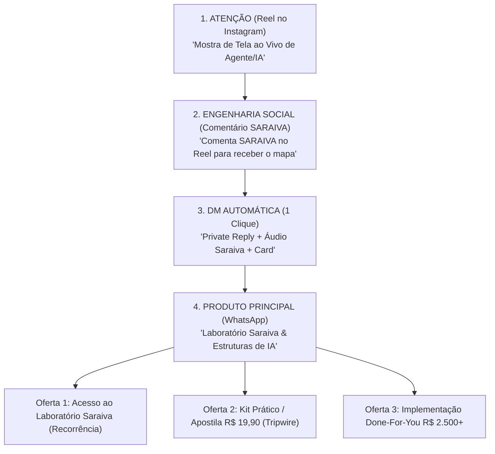

# 🚀 Funil Definitivo: Laboratório Saraiva como Produto Principal

> **"Toda a atenção gerada no Instagram (@saraiva.ai) agora converge para um único destino de autoridade e receita: O Laboratório Saraiva no WhatsApp."**

---

## 📐 A Arquitetura do Funil de 3 Passos (Laboratório Saraiva)

---

## 🛠️ As 3 Etapas Exatas do Fluxo no `@saraiva.ai`

### 🔹 Etapa 1: A Entrada no Direct (Private Reply Imediata)
- **Gatilho no Reel:** Seguidor comenta `SARAIVA` no vídeo.
- **Private Reply no Direct:**
  > *"Fala {Nome}! Vi que você comentou no Reel sobre o Agente de IA. Não vou te enrolar com questionário: deixei o botão aqui embaixo pra você acessar a estrutura no Laboratório Saraiva."*
- **Botão Interativo de 1 Clique:** **`ACESSAR LABORATÓRIO`**

---

### 🔹 Etapa 2: O Áudio de Voz Humana (Voz Saraiva no ElevenLabs)
- **Envio Automático:** 2 segundos após a Private Reply, o bot envia o áudio com a voz natural do Saraiva:
  > *"{Nome}, se você quer colocar uma estrutura de IA rodando no seu negócio sem apanhar do código, ficar na teoria é um ralo de dinheiro.*  
  > *No **Laboratório Saraiva**, eu compartilho as estruturas brutas pra você copiar, adaptar e colocar pra rodar hoje. Clica no botão aqui embaixo e pega o acesso. Faz sentido pra você?"*

---

### 🔹 Etapa 3: O Card do Produto Principal (WhatsApp)
- **Título do Card:** `Laboratório Saraiva & IA`
- **Subtítulo:** `Acesse as estruturas reais, agentes e bastidores de IA para copiar e adaptar no seu negócio.`
- **Botão de Ação:** **`ACESSAR LABORATÓRIO`** *(redireciona diretamente para o WhatsApp)*

---

## 💰 Como o Laboratório Saraiva Monetiza no WhatsApp

Quando o lead clica no botão e entra no **Laboratório Saraiva** no WhatsApp, ele encontra a esteira de produtos configurada:

1. **Laboratório VIP (Produto Principal - Recorrência):**
   - R$ 97/mês ou R$ 497/ano para acessar todos os prompts, fluxos do n8n/Bedrock e novos agentes lançados.
2. **Apostila / Kit de Entrada (Tripwire):**
   - R$ 19,90 para quem quer apenas a apostila rápida do `@Sites`.
3. **Implementação Sob Medida (B2B):**
   - R$ 2.500 a R$ 5.000 para empresas que querem a equipe do Saraiva implementando os agentes dentro do seu negócio.

---

## 📋 Arquivos do Projeto Alinhados ao Funil

- **Fluxo do Instagram:** [`src/instagram/automationFlow.ts`](file:///Users/saraiva/_Projetos/respondedorinstagram/src/instagram/automationFlow.ts)
- **Script do Áudio:** [`src/instagram/personalizedOffer.ts`](file:///Users/saraiva/_Projetos/respondedorinstagram/src/instagram/personalizedOffer.ts)
- **Documento no Obsidian:** Saved in `03 - Playbooks de Vendas/Funil do Laboratório Saraiva.md`.
