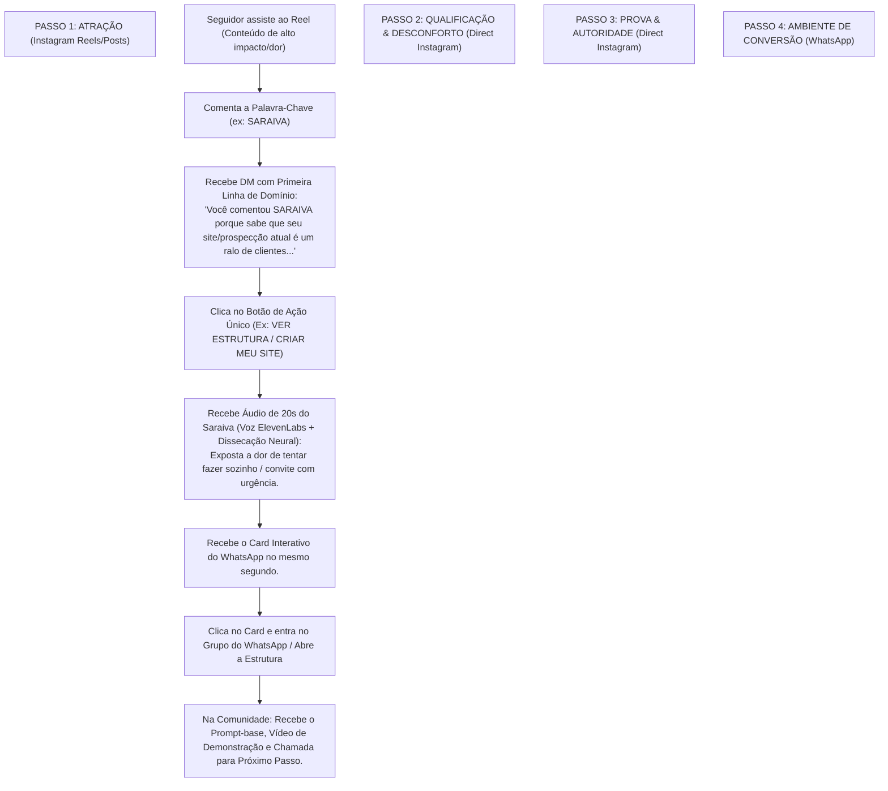

# Arquitetura do Produto Final & Caminho da Jornada de Vendas

> **"Automação no Instagram não serve para entreter — serve para qualificar a intenção e conduzir o seguidor para a zona de conversão final."**  
> *Mapeamento Estratégico do Produto Final e a Jornada Inevitável do Seguidor*

---

## 🎯 1. O Que É o "Produto Final"? (A Visão do Negócio)

Para o seu ecossistema, a automação do Instagram não é o destino, é a **porta de entrada**. O funil existe para conduzir a audiência para **3 Ativos de Conversão Reais**:

| Produto / Ativo Final | O que a pessoa recebe | Qual é a Promessa / Valor | Objetivo de Caixa / Negócio |
| :--- | :--- | :--- | :--- |
| **1. Comunidade Gratuita no WhatsApp** | Acesso ao grupo de bastidores e estruturas. | *"Aprender a criar e copiar estruturas de prospecção e IA que rodam de verdade."* | Aquecimento contínuo de audiência para vendas de Mentorias / Programas de Alto Ticket. |
| **2. Ferramenta / Workshop @Sites** | Prompt-base + Guia de criação de sites com ChatGPT. | *"Montar e publicar um site profissional em minutos sem programar."* | Entrada no ecossistema + Venda da Apostila/Guia de R$ 19,90 ou produto Cliente Pronto. |
| **3. Serviço / Implementação Agentica** | Solução pronta de automação de prospecção/vendas. | *"Ter uma máquina de prospecção e atendimento rodando na própria empresa."* | Venda de projetos de implementação de automação de R$ 2k - R$ 10k+. |

---

## 🛣️ 2. O Caminho Ideal do Seguidor (Passo a Passo Fim a Fim)

Abaixo está o **caminho exato e otimizado** que o seguidor deve percorrer para que o funil tenha a máxima conversão:

---

## ⚡ 3. Análise Crítica dos Caminhos Internos

Para saber exatamente **qual caminho seguir**, dividimos os seguidores em 2 Perfis Primários:

### 👤 Perfil A: "Quero a Solução Pronta" (Quem quer o resultado logo)
- **O que ele quer:** O prompt do site funcionando, o template pronto ou alguém que faça por ele.
- **Caminho Otimizado:** 
  1. Comenta `SARAIVA`.
  2. Recebe a DM com o botão `CRIAR MEU SITE`.
  3. Áudio curto focando na facilidade do `@Sites` + prompt-base.
  4. Card levando direto pro grupo/tutorial do WhatsApp.
- **Onde converte:** Na oferta da Apostila (`R$ 19,90`) ou Serviço Pronto (`Cliente Pronto`).

### 👤 Perfil B: "Quero Aprender a Criar" (Quem é dev, criador ou entusiasta de IA)
- **O que ele quer:** Entender como a automação foi montada (n8n, Zernio, Bedrock, ElevenLabs).
- **Caminho Otimizado:**
  1. Comenta no Reel de automação/IA.
  2. Recebe a DM com o botão `VER ESTRUTURA`.
  3. Áudio mostrando os bastidores da construção.
  4. Card levando para a Comunidade de Automação no WhatsApp.
- **Onde converte:** Em Mentorias, Comunidade VIP ou Cursos de Formação de Agentes.

---

## 📋 4. O Que Fazer Agora para Perfeita Alinhamento?

Para garantir que esse produto final e caminho fiquem **perfeitos**:

1. **Garantir que a mensagem de boas-vindas do Grupo do WhatsApp esteja sincronizada com o que prometemos no Direct** (ex: fixar o prompt do `@Sites` na descrição do grupo).
2. **Definir se você deseja que o Bedrock AI venda diretamente a Apostila de R$ 19,90 no Direct** quando a pessoa fizer perguntas sobre comprar o modelo pronto.
