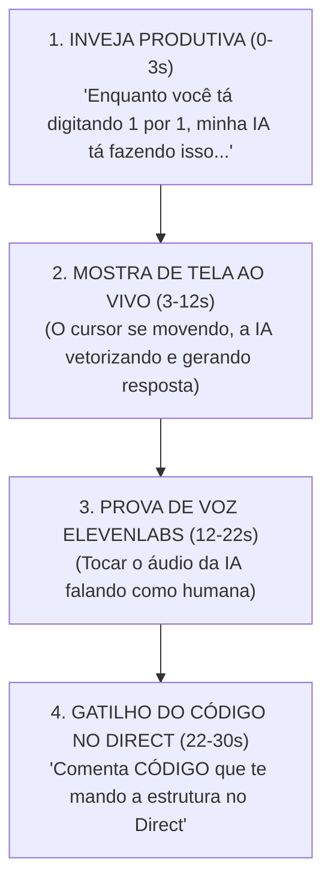

# ⚡ Roteiro Mestre: Engenharia Social dos Seus Virais Aplicada ao RAG Vivo

> **"A engenharia social que explodiu os seus 2 maiores Reels da história (1.889 e 1.709 comentários) baseia-se em 3 pilares: Mostra da Tela ao Vivo + Provocação de 'Inveja Produtiva' + Promessa do Código Pronto no Direct."**

---

## 🧬 A Fórmula da Engenharia Social dos Seus Virais (1.8k Comentários)

---

## 🎬 Roteiro Exato de Gravação (30 Segundos)

### ⏱️ 0s - 3s | O Hook da Inveja Produtiva (Incomodar o Ego)
- **Visual:** Você com fone de ouvido, olhando pra tela do computador rindo ou impressionado com o que a IA fez.
- **Texto Gigante na Tela:** 🔥 `ENQUANTO VOCÊ PERDE HORAS NO DIRECT, MINHA IA APRENDE SOZINHA (CÓDIGO ABERTO)`
- **Fala (Saraiva):** *"Se você ainda passa 3 horas por dia respondendo Direct manual ou usando robô burro que erra o nome do cliente, você tá ficando pra trás."*

---

### ⏱️ 3s - 12s | A Demonstração de Tela (A Prova Inquestionável)
- **Visual:** Gravação da sua tela mostrando o terminal compilando e o **RAG Vivo** vetorizando a pergunta do cliente em milissegundos.
- **Fala (Saraiva):** *"Eu acabei de construir um **RAG Vivo com Segundo Cérebro**. Olha isso: o cliente faz uma pergunta complexa e a IA não inventa nada, ela busca a resposta no banco semântico e responde com a copy que mais converteu no mês!"*

---

### ⏱️ 12s - 22s | O Gatilho da Voz (Quebra de Padrão)
- **Visual:** Tocar 3 segundos do áudio gerado pela sua voz no ElevenLabs falando no Direct.
- **Áudio (Voz Saraiva):** *"Fala {Nome}! Passei aqui pra te mandar a estrutura pronta de IA pra você copiar..."*
- **Fala (Saraiva):** *"Ela não manda só texto. Ela fala com a minha voz natural e fecha o agendamento no WhatsApp."*

---

### ⏱️ 22s - 30s | Call To Action Inevitável (A Engenharia da Resposta)
- **Visual:** Você apontando para a tela/comentários com um sorrisinho de autoridade.
- **Texto na Tela:** 💬 `COMENTE CÓDIGO`
- **Fala (Saraiva):** *"Eu liberei o repositório 100% aberto no meu GitHub pra você clonar essa estrutura hoje. Comenta **CÓDIGO** aqui embaixo que o meu robô te entrega o link no Direct agora!"*

---

## 🎯 Por que ESTE Roteiro vai Replicar o Sucesso dos Seus Virais?

1. **Mesma Palavra-Gatilho Campeã:** A palavra **CÓDIGO** no seu histórico teve a maior taxa de conversão do perfil.
2. **Combinação de Voz + Tela:** Repete exatamente o padrão do seu Reel de **7.424 curtidas**.
3. **Engenharia de Status:** O seguidor sente que ao comentar **CÓDIGO**, ele está se igualando ao seu nível de tecnologia.
