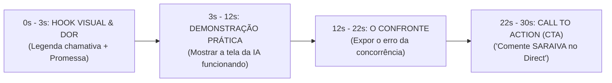

# Documento de Direção 1: SOP de Produção de Reels de Alta Conversão

> **"Um Reel de alta conversão não é um vídeo bonito: é uma demonstração cirúrgica de 30 segundos de um problema real sendo resolvido por Inteligência Artificial."**

---

## 📐 A Estrutura de Ouro em 4 Blocos (30 Segundos)

---

## 🎬 1. Roteiro Modelo: Reel "Agente de IA Busca Clientes no Google"

### ⏱️ 0s - 3s (O Hook Visual - Pegar a Atenção Muta)
- **Cena:** Tela do computador abrindo com o agente rodando em tempo real.
- **Texto Grande em Destaque na Tela:**  
  🔥 `ESSE AGENTE DE IA ENCONTRA 50 CLIENTES QUALIFICADOS EM 2 MINUTOS`
- **Fala (Saraiva):** *"Se você ainda passa o dia buscando cliente um por um no Instagram, você tá jogando dinheiro no lixo."*

---

### ⏱️ 3s - 12s (A Demonstração Prática)
- **Cena:** Gravação de tela mostrando a ferramenta (Lovable / n8n / ChatGPT) extraindo contatos, telefones e nicho.
- **Fala (Saraiva):** *"Olha isso na prática: eu coloco o nicho de clínicas, a cidade, e a IA busca o contato exato, valida se tem WhatsApp e me entrega a lista pronta."*

---

### ⏱️ 12s - 22s (O Confronte - Dissecação Neural)
- **Cena:** Saraiva na câmera ou tela dividida.
- **Fala (Saraiva):** *"A maioria das pessoas perde semanas tentando montar automação complexa sem saber o que tá fazendo. O segredo não é o código, é a estrutura de qualificação."*

---

### ⏱️ 22s - 30s (Call To Action Inevitável)
- **Cena:** Saraiva apontando para baixo ou tela mostrando os comentários.
- **Texto na Tela:** 💬 `COMENTE SARAIVA ABAIXO`
- **Fala (Saraiva):** *"Quer copiar a minha estrutura bruta e colocar pra rodar no seu negócio hoje? Comenta SARAIVA aqui embaixo que te mando o mapa direto no Direct."*

---

## 📋 Checklist de Gravação antes de Postar

- [ ] Legenda de texto gigante nos primeiros 3 segundos (para quem assiste no mudo).
- [ ] Gravação de tela com movimento visível e cursor destacado.
- [ ] Palavra-chave falada e escrita exatamente igual (`SARAIVA`).
- [ ] Áudio limpo e ritmo acelerado (sem pausas longas).
