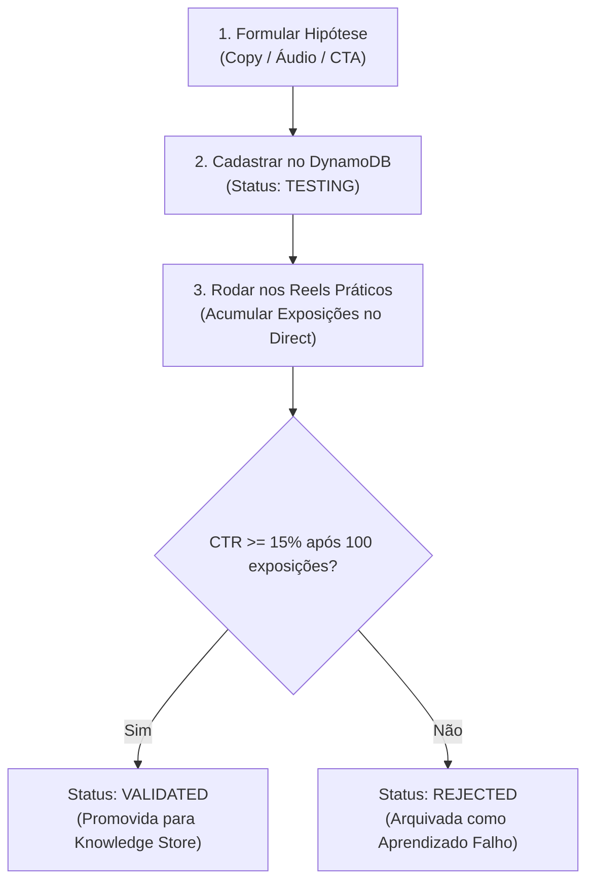

# Documento de Direção 2: Guia de Operação do Segundo Cérebro (Gestão de Experimentos A/B)

> **"Nenhuma alteração de copy, áudio ou oferta no Instagram deve ser feita no achismo. Tudo é testado como uma hipótese registrada no Segundo Cérebro até ser validada ou rejeitada por dados reais."**

---

## 🔬 O Ciclo de Vida de uma Hipótese no Segundo Cérebro



---

## 🛠️ Como Cadastrar um Novo Teste no Segundo Cérebro

Para criar uma nova hipótese via terminal ou código, utilizamos a função `registerHypothesis`:

```typescript
import { registerHypothesis } from './src/secondBrain/hypothesisEngine.js';

await registerHypothesis(
  'HYP-2026-08-DIRECT-VOZ-V1',
  'Áudio Saraiva com Provocação de Procrastinação',
  'Testar se áudio confrontando o atraso do lead aumenta cliques no WhatsApp',
  'audio_script',
  'Script A: Você comentou SARAIVA porque sabe que seu site atual é um ralo de clientes...',
  'Script B: Olha, deixar essa automação pra depois é perder vendas todo dia...'
);
```

---

## 📊 Matriz de Decisão do Segundo Cérebro

| Métrica | Critério de Aprovação (`VALIDATED`) | Critério de Rejeição (`REJECTED`) | Ação do Sistema |
| :--- | :---: | :---: | :--- |
| **Taxa de Clique no WhatsApp (CTR)** | **>= 15,0%** | **< 5,0%** | Se aprovada, vira a copy oficial de produção. |
| **Amostra Mínima** | 100 exposições ativas | 100 exposições ativas | Impede conclusões precipitadas com poucos leads. |
| **Retenção do Áudio** | Ouvintes até o final >= 80% | Ouvintes até o final < 40% | Recalibra o tom da voz no ElevenLabs. |

---

## 📑 Comando de Consulta Rápida ao Diário do Segundo Cérebro

Para extrair o relatório de aprendizados ativos no terminal:

```bash
aws lambda invoke --function-name respondedor-instagram-saraiva-os --cli-binary-format raw-in-base64-out --payload '{"action":"exportSecondBrainReport"}' brain_report.json
```
