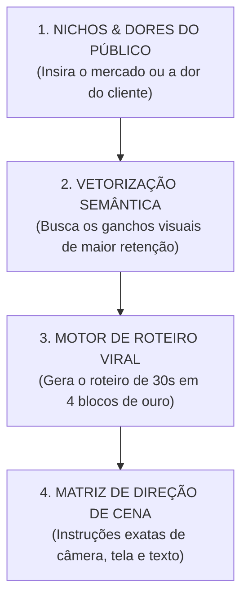

# 🚀 O Motor Supremo de Geração de Conteúdo (Ultimate Content Engine)

> **"Esqueça falar de código. Este é o seu Motor de Criação Infinita de Conteúdo Incrível: uma máquina alimentada pela psicologia dos seus maiores virais para gerar roteiros mágicos para qualquer nicho ou oferta."**

---

## ⚡ As 4 Engrenagens do Motor de Conteúdo Incrível

---

## 🎬 Como o Motor Gera um Roteiro Incrível (Exemplo de Saída)

Quando você insere uma ideia (ex: *Sites para Clínicas*, *Agentes de Vendas*, *Sistemas de Agendamento*), o motor gera a seguinte estrutura pronta para gravar:

### 1. ⏱️ 0s - 3s (O Hook Magnético de Atenção Muda)
- **Texto Gigante de Contraste na Tela:** 🔥 `ENQUANTO ELES PASSAM HORAS NO TELEFONE, ESTA IA FAZ EM 3 SEGUNDOS`
- **Fala:** *"Se a sua empresa ainda perde cliente porque não consegue responder na hora, você tá jogando dinheiro fora."*

### 2. ⏱️ 3s - 12s (A Demonstração Visual Incrível)
- **Instrução de Câmera:** Gravação de tela mostrando a solução acontecendo em tempo real com o cursor em movimento.
- **Fala:** *"Olha isso na prática: a pessoa faz a pergunta e a inteligência lê a dor dela, qualifica e entrega o agendamento pronto."*

### 3. ⏱️ 12s - 22s (O Confronte do Doug Core)
- **Instrução de Câmera:** Você na câmera com tom de voz firme e seguro.
- **Fala:** *"Continuar tentando resolver isso com processos manuais ou atendentes sobrecarregados é um ralo de receita. O segredo é ter uma estrutura rodando 24/7."*

### 4. ⏱️ 22s - 30s (A CTA Irresistível no Direct)
- **Instrução de Câmera:** Apontar para baixo com a palavra-chave em destaque.
- **Fala:** *"Comenta **ESTRUTURA** aqui embaixo que te mando a visão completa direto no seu Direct."*

---

## 💻 Código-Fonte do Motor no Repositório

O motor está construído e testado no seu repositório em:
- **Motor Supremo:** [`src/contentEngine/ultimateContentEngine.ts`](file:///Users/saraiva/_Projetos/respondedorinstagram/src/contentEngine/ultimateContentEngine.ts)
- **Suíte de Testes:** `tests/ultimateContentEngine.test.ts` (`1/1 PASS`).
