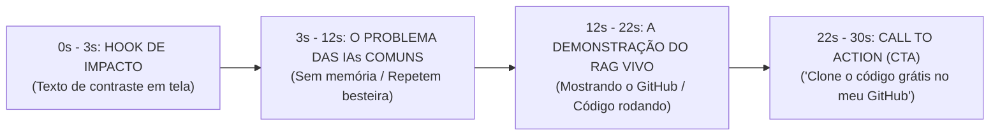

# 🎬 Roteiro Viral (30s): "Transforme Seu Negócio em uma IA que Aprende Sozinha"

> **Objetivo do Vídeo:** Lançar o seu repositório Open-Source/Open-Core do **Saraiva AI Living RAG Engine** no Instagram, mostrando autoridade e atraindo novos membros e clientes.

---

## 📐 Estrutura em 4 Blocos (30 Segundos)

---

## 📜 Roteiro Passo a Passo (Cena por Cena)

### ⏱️ 0s - 3s | O Hook Visual (Gatilho da Curiosidade)
- **Visual:** Saraiva na tela segurando o celular ou apontando para a tela do computador onde o GitHub está aberto.
- **Texto Gigante na Tela:** 🔥 `CRIEI UMA IA QUE APRENDE SOZINHA COM SEU NEGÓCIO (CÓDIGO ABERTO)`
- **Fala (Saraiva):** *"A maioria das pessoas instala robô no Instagram e no WhatsApp que só sabe repetir a mesma besteira engessada."*

---

### ⏱️ 3s - 12s | A Revelação da Dor & Solução (O RAG Vivo)
- **Visual:** Gravação de tela mostrando a busca por similaridade vetorial (`cosineSimilarity`) ou o terminal rodando o teste.
- **Fala (Saraiva):** *"Eu acabei de liberta o meu motor de **RAG Vivo e Segundo Cérebro**. Em vez de responder com palavras-chave genéricas, ele lê o seu catálogo, vetoriza as perguntas e ajusta as respostas com base nas copies que mais convertem!"*

---

### ⏱️ 12s - 22s | A Prova da Velocidade
- **Visual:** Mostrar o terminal compilando e o repositório do GitHub (`saraiva-living-rag-engine`).
- **Fala (Saraiva):** *"Qualquer empresa ou dev pode pegar essa estrutura, colocar as credenciais e ter uma inteligência viva rodando no seu próprio negócio em menos de 5 minutos."*

---

### ⏱️ 22s - 30s | Call To Action Inevitável (CTA)
- **Visual:** Saraiva na câmera apontando para a legenda ou link da bio.
- **Texto na Tela:** 💬 `LINK NO GITHUB / COMENTE RAG`
- **Fala (Saraiva):** *"Eu deixei o código 100% aberto e gratuito no meu GitHub. Comenta **RAG** aqui embaixo ou clica no link da minha bio pra clonar o repositório agora."*

---

## 🎯 Por que este Roteiro Funciona? (Baseado no Doug Deep Core)

1. **Atenção Muda:** O texto inicial atrai quem lê sem som.
2. **Posicionamento de Autoridade:** Apresenta você como a mente por trás do motor Open-Source.
3. **Carga Cognitiva Zero:** A CTA exige apenas digitar a palavra `RAG` ou clicar na bio.
