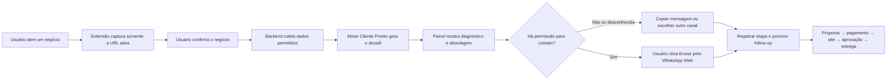

# Plano SaraivaOS — Extensão Chrome Cliente Pronto

Data da pesquisa: 29 de julho de 2026  
Status: blueprint; nenhuma extensão foi publicada ou ativada.

## 1. Decisão

Construir uma extensão Chrome Manifest V3 chamada provisoriamente **Cliente Pronto**.

Ela deve funcionar como um painel lateral que transforma um negócio selecionado pelo usuário em:

1. diagnóstico comercial;
2. três abordagens revisáveis;
3. oferta e referência de preço;
4. proposta;
5. contrato-base;
6. prompt para Work + `@Sites`;
7. checklist de produção e entrega;
8. oportunidade registrada no funil.

O MVP não deve fazer scraping em massa nem disparar mensagens frias em lote. A extensão atua como **copiloto de prospecção** e usa o WhatsApp Web já autenticado no navegador. Depois de revisar a mensagem, o usuário clica em **“Enviar pelo WhatsApp Web”**; a extensão abre a conversa, preenche e aciona o envio a partir desse comando explícito.

A extensão não copia sessão, cookies, QR Code ou credenciais. O usuário continua responsável por confirmar que pode contatar o destinatário. Automação autônoma e recorrente só entra para destinatários com consentimento comprovado.

## 2. Sinais observados

| Sinal | Classificação | Implicação |
|---|---|---|
| O projeto já possui `lookupBusinessWithApify()`, `buildClientReadyKit()` e `buildReadySitePrompt()` | Observado no código | O motor que gera o dossiê pode ser reutilizado |
| O checkout e a confirmação de pagamento já passam pela Woovi | Observado no código e no site | A extensão precisa de uma camada de conta e entitlement, não de outro checkout isolado |
| Chrome suporta painel lateral em extensões Manifest V3 | Documentação oficial | O painel lateral é a interface adequada para acompanhar a navegação |
| Manifest V3 usa service worker não persistente e proíbe código remoto executável | Documentação oficial | Processamento durável deve ficar no backend; o pacote da extensão deve conter seu próprio código |
| A Chrome Web Store exige finalidade única, permissões mínimas, consentimento e política de privacidade | Política oficial | O acesso ao WhatsApp Web deve ser restrito, explicado e ativado para o envio solicitado pelo usuário |
| WhatsApp exige número fornecido e opt-in para contato; conversas iniciadas pela empresa usam template aprovado | Política oficial | Disparo frio automático não deve ser parte do produto |
| Google restringe scraping, armazenamento e criação de listas a partir do conteúdo do Maps | Termos oficiais | Capturar somente o negócio que o usuário escolheu, evitar coleta em massa e revisar a base jurídica/licença do provedor |
| Há extensões que extraem Maps, geram mensagens e fazem CRM/disparo | Chrome Web Store | “Mais um scraper” é uma categoria concorrida e frágil |

## 3. Assimetria

Os concorrentes encontrados concentram a promessa em:

- extrair listas;
- exportar CSV;
- gerar uma mensagem;
- disparar sequências;
- sincronizar conversas com CRM.

O espaço mais interessante para o Cliente Pronto é outro:

> Não entregar uma lista de telefones. Entregar um projeto comercial executável para um negócio escolhido.

O diferencial é conectar prospecção, argumento, proposta, contrato, criação do site, aprovação e entrega. O usuário não recebe “leads”; recebe uma próxima ação comercial preparada.

## 4. Experiência do produto



### Telas do painel lateral

1. **Entrada**
   - login;
   - saldo ou acesso;
   - botão “Analisar este negócio”.

2. **Confirmação**
   - nome;
   - categoria;
   - cidade;
   - telefone;
   - site;
   - origem de cada dado;
   - confirmação do usuário antes de gerar.

3. **Oportunidade**
   - sinal principal;
   - score explicável;
   - por que o negócio pode precisar de um site;
   - fatos a confirmar.

4. **Abordagem**
   - três mensagens rotativas;
   - edição antes de copiar;
   - status de permissão: confirmado, desconhecido ou bloqueado;
   - botão “Copiar”;
   - botão “Enviar pelo WhatsApp Web”;
   - confirmação antes do envio;
   - estado “acionado”, sem afirmar entrega quando o DOM não provar.

5. **Dossiê**
   - oferta;
   - proposta;
   - contrato-base;
   - prompt Work + `@Sites`;
   - checklist;
   - download.

6. **Funil**
   - identificado;
   - preparado;
   - contato permitido;
   - respondeu;
   - proposta enviada;
   - ganhou;
   - perdido;
   - follow-up.

## 5. Arquitetura recomendada

### Extensão

- Chrome Manifest V3;
- TypeScript + React;
- Side Panel API;
- service worker para eventos leves;
- `chrome.storage.local` apenas para preferências e estado não sensível;
- autenticação com `chrome.identity.launchWebAuthFlow`;
- código totalmente empacotado, sem JavaScript remoto;
- atualização pela Chrome Web Store.

### Permissões iniciais

- `activeTab`;
- `scripting`;
- `storage`;
- `sidePanel`;
- permissão opcional e restrita para a página do negócio;
- `https://web.whatsapp.com/*`, explicada ao usuário e usada somente no fluxo de envio.

Não solicitar no MVP:

- histórico completo;
- cookies;
- leitura da lista completa de conversas;
- acesso a todas as páginas;
- credenciais ou tokens do usuário.

### Adaptador do WhatsApp Web

O envio assistido funciona assim:

1. o usuário revisa a mensagem e confirma que pode contatar o número;
2. o painel cria uma intenção de envio com identificador único e expiração curta;
3. o service worker abre `web.whatsapp.com/send` com telefone e texto;
4. um content script restrito ao WhatsApp Web aguarda o compositor ficar pronto;
5. o script confere a intenção, preenche a mensagem e aciona o botão de envio;
6. o backend registra `send_triggered`, nunca `delivered` sem evidência real;
7. a mesma intenção não pode ser executada duas vezes.

O adaptador não deve:

- ler chats antigos;
- exportar contatos;
- acessar cookies;
- persistir o conteúdo de conversas;
- operar sem uma ação explícita do usuário;
- contornar bloqueios, limites ou mudanças impostas pelo WhatsApp.

### Backend

Reutilizar a Lambda existente e separar uma API autenticada para a extensão:

```text
POST /extension/session
POST /extension/business/preview
POST /extension/dossiers
GET  /extension/dossiers/:id
GET  /extension/pipeline
PATCH /extension/pipeline/:leadId
POST /extension/contact-intents
GET  /extension/entitlement
```

O backend deve:

- manter Apify, Woovi e demais segredos somente no servidor;
- validar usuário, plano, limite e idempotência;
- limitar requisições;
- registrar auditoria;
- evitar guardar conteúdo do navegador que não seja necessário;
- permitir exportação e exclusão dos dados da conta.

### Dados mínimos

```text
account
entitlement
business_reference
dossier
contact_permission
pipeline_stage
follow_up_at
activity_log
```

Cada dado deve carregar:

- origem;
- data de coleta;
- classificação: fornecido, observado, inferido ou pendente;
- prazo de retenção;
- usuário responsável.

## 6. Limite de automação

### Permitido no MVP

- analisar o negócio selecionado;
- chamar o backend;
- gerar dossiê;
- personalizar e rotacionar mensagens;
- copiar mensagem;
- enviar uma mensagem pelo WhatsApp Web após clique e confirmação do usuário;
- registrar ação;
- lembrar follow-up;
- medir geração, uso e avanço no funil.

### Somente com consentimento comprovado

- programar follow-up;
- interromper sequência após resposta;
- respeitar opt-out;
- oferecer transferência para atendimento humano.

Para escala, templates e campanhas, migrar o envio para a WhatsApp Business Platform oficial.

### Fora do produto

- rolar Maps e coletar centenas de negócios invisivelmente;
- criar listas de telemarketing baseadas em conteúdo do Google;
- ler cookies, lista de chats ou histórico de conversas do WhatsApp Web;
- disparar mensagens frias em massa;
- tentar contornar bloqueios, limites ou revisão das plataformas;
- prometer que usar Apify elimina os termos do Google.

## 7. Oferta e pagamento

Preço informado para a nova oferta: **5x de R$19,90**, total de **R$99,50**.

Antes de alterar o checkout, definir:

- o que o pagamento libera: licença, número de dossiês ou período de acesso;
- quando o acesso começa;
- o que acontece em atraso ou cancelamento;
- se as cinco cobranças serão Pix Automático ou outro meio;
- política de reembolso;
- atualizações incluídas.

Recomendação de embalagem:

> Cliente Pronto Chrome — transforme um negócio escolhido em abordagem, proposta e site preparado, sem copiar e colar entre cinco ferramentas.

O preço deve aparecer apenas quando a cobrança real de cinco parcelas estiver implementada e testada ponta a ponta.

## 8. Roadmap

### Fase 0 — Prova técnica

Objetivo: provar que a extensão consegue ler a aba ativa, confirmar um negócio e receber o dossiê atual.

Entregas:

- esqueleto Manifest V3;
- painel lateral;
- login de teste;
- botão “Analisar este negócio”;
- chamada ao ambiente de desenvolvimento;
- resultado do dossiê no painel.
- adaptador de WhatsApp Web em ambiente de teste;
- confirmação e intenção idempotente de envio.

Critério de passagem:

- 10 negócios escolhidos manualmente;
- pelo menos 9 dossiês gerados corretamente;
- 10 mensagens de teste enviadas somente para números controlados;
- nenhum envio duplicado ou sem clique explícito;
- origem dos dados visível.

### Fase 1 — MVP comercial

Objetivo: transformar o dossiê em fluxo de trabalho.

Entregas:

- edição e rotação das três abordagens;
- copiar ou enviar pelo WhatsApp Web após confirmação;
- pipeline;
- follow-up;
- download;
- entitlement conectado à Woovi;
- telemetria;
- exclusão de conta e dados.

Critério de passagem:

- cinco usuários piloto concluem o fluxo;
- tempo mediano entre seleção e dossiê abaixo de 120 segundos;
- nenhuma mensagem enviada sem ação explícita;
- nenhum cookie, QR Code ou histórico de conversa coletado;
- 100% das ações comerciais registradas.

### Fase 2 — Automação permitida

Objetivo: automatizar apenas onde existe opt-in verificável.

Entregas:

- conexão com WhatsApp Business Platform;
- registro de consentimento;
- templates aprovados;
- opt-out;
- pausa após resposta;
- transferência humana.

Critério de passagem:

- templates aprovados;
- opt-in auditável em todas as mensagens iniciadas;
- opt-out funcionando;
- nenhum envio fora das regras de janela e template.

### Fase 3 — Publicação

Objetivo: liberar beta na Chrome Web Store.

Entregas:

- política de privacidade;
- termos;
- disclosure dentro da extensão;
- formulário de práticas de privacidade da loja;
- ícones, screenshots e vídeo;
- revisão das permissões;
- teste de instalação, atualização e remoção;
- suporte e canal de exclusão de dados.

Critério de passagem:

- extensão aprovada na Chrome Web Store;
- auditoria de permissões sem acesso desnecessário;
- primeira compra real confirmada;
- acesso liberado conforme o pagamento;
- primeiro dossiê real gerado pelo comprador.

## 9. Experimento inicial

**Hipótese:** usuários que hoje copiam dados do Maps, escrevem mensagens e montam propostas separadamente perceberão valor em concluir o mesmo trabalho dentro de um painel lateral.

**Amostra inicial:** cinco usuários que já vendem sites para negócios locais.

**Tarefa:** escolher três negócios cada e produzir um dossiê, sem disparo automático.

**Baseline a medir antes:** tempo gasto por negócio e número de ferramentas abertas.

**Métricas:**

- tempo até o dossiê;
- taxa de geração concluída;
- percentual de mensagens editadas;
- negócios movidos para o funil;
- intenção de pagar 5x de R$19,90;
- incidentes de permissão, dado incorreto ou envio indevido.

**Decisão:**

- avançar se quatro dos cinco pilotos concluírem o fluxo e pelo menos três preferirem a extensão ao processo atual;
- ajustar se houver valor percebido, mas os dados ou a experiência falharem;
- interromper a automação de WhatsApp se não houver consentimento rastreável.

## 10. Riscos que precisam de decisão

| Risco | Tratamento |
|---|---|
| Restrição do Google a scraping e armazenamento | operação por negócio escolhido, retenção mínima e revisão jurídica/licença antes da publicação |
| WhatsApp sem opt-in | exigir confirmação do usuário, limitar o MVP a envio assistido e não oferecer disparo autônomo em lote |
| Reprovação na Chrome Web Store | finalidade única, permissões mínimas, disclosure e política de privacidade |
| DOM do Maps muda | extensão envia URL/ação ao backend; não depender de seletores frágeis para todo o produto |
| Usuário confunde sugestão com fato | mostrar origem e marcar inferências |
| Uso abusivo | limites, auditoria, bloqueio, opt-out e termos |
| Cobrança 5x não corresponde ao checkout | só anunciar após prova de cinco cobranças e liberação correta |

## 11. Fontes

- [Chrome: Manifest V3](https://developer.chrome.com/docs/extensions/develop/migrate/what-is-mv3)
- [Chrome: Side Panel API](https://developer.chrome.com/docs/extensions/reference/api/sidePanel)
- [Chrome: Identity API](https://developer.chrome.com/docs/extensions/reference/api/identity)
- [Chrome Web Store: políticas de dados](https://developer.chrome.com/docs/webstore/user_data)
- [Chrome Web Store: políticas do programa](https://developer.chrome.com/docs/webstore/program-policies/policies)
- [Google Maps Platform: termos](https://cloud.google.com/maps-platform/terms)
- [Google Maps JavaScript API: políticas e scraping](https://developers.google.com/maps/documentation/javascript/policies)
- [WhatsApp Business Messaging Policy](https://whatsappbusiness.com/policy/)
- [ANPD: guia de legítimo interesse](https://www.gov.br/anpd/pt-br/centrais-de-conteudo/materiais-educativos-e-publicacoes/guia_orientativo_hipoteses_legais_tratamento_de_dados_pessoais_legitimo_interesse)
- [Chrome Web Store: Google Maps Lead Finder AI](https://chromewebstore.google.com/detail/google-maps-lead-finder-a/kpagolangecppljjffkcgemblkggcflm)
- [Chrome Web Store: WASync](https://chromewebstore.google.com/detail/wasync-send-whatsapp-chat/oppeochfgocfmljjikiiadoaglaghknc)

## Próximo movimento

Construir somente a Fase 0 como extensão não publicada, validar com cinco usuários e medir tempo até o dossiê, para decidir se o produto avança ao MVP comercial.
