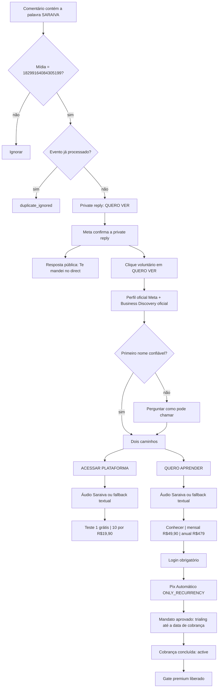

# SexyFlow Instagram → Plataforma ou Comunidade

Status: **implementado e validado localmente; produção permanece desativada**.

## Fluxo executável



## Rastro observável

O sistema persiste um diário auditável; ele registra fatos, regra, resultado e
`reasonCode`, sem expor raciocínio interno:

| Evento | Regra | `reasonCode` |
|---|---|---|
| mídia + palavra exatas | iniciar uma vez | `campaign_match` |
| clique no botão | perfil somente após opt-in | `opt_in_received` |
| nome incerto | perguntar, nunca inferir | `name_confirmation_required` |
| caminho escolhido | payload determinístico | `path_selected` |
| áudio enviado | fatos oficiais permitidos | `audio_sent` |
| TTS indisponível | texto equivalente e card continuam | `audio_fallback_text` |
| falha externa | retry por SQS e alerta técnico | `technical_alert` |

O relatório `exportInstagramEngagementReport` inclui `automationJourneys` com
correlação, estágio, caminho, fatos, script, status do áudio e decisões.

## Segurança e limites

- A chave ElevenLabs exposta não é aceita por variável direta: o runtime exige
  `ELEVENLABS_SECRET_ID` e lê uma chave nova do Secrets Manager.
- O script usa no máximo dois fatos oficiais, com fonte, evidência, confiança e
  permissão explícita para áudio.
- Não há scraping de perfil ou posts.
- Seguidores, relação de follow, renda, aparência e dados sensíveis não entram
  no áudio.
- MP3 fica em bucket privado, criptografado por KMS e com URL assinada por uma
  hora. O template `infra/sexyflow-audio-bucket.yaml` aplica lifecycle real de
  um dia, bloqueio público e TLS obrigatório.
- Limite diário padrão: 100 áudios, aplicado atomicamente no DynamoDB.
- Concorrência da fila: 3; DLQ após cinco tentativas.
- Webhook Woovi exige HMAC `x-openpix-signature` ou autorização compartilhada.

## Provas automatizadas

- Respondedor: `npm run typecheck` e `npm test` — 97 testes aprovados.
- Social Sales: typecheck do monorepo aprovado; normalizer, inbound, contracts e
  publisher aprovados; CDK cobre fila e DLQ.
- Comunidade: `pnpm lint` sem erros, `pnpm typecheck`, 5 testes automatizados e
  `pnpm build` aprovados.
- A busca de regressão do fluxo não encontra botão, payload ou estado de
  atendimento humano dentro do SexyFlow.

## Flags de ativação

Todas começam desligadas:

```text
INSTAGRAM_AUTOMATION_ROUTING_ENABLED=false
INSTAGRAM_AUTOMATION_QUEUE_ARN=
INSTAGRAM_PROFILE_ENRICHMENT_ENABLED=false
INSTAGRAM_PERSONALIZATION_ENABLED=false
INSTAGRAM_CHECKOUT_ENABLED=false
WEBHOOK_RESPONDER_ENABLED=false
WEBHOOK_DM_ENABLED=false
WEBHOOK_COMMENT_ENABLED=false
INSTAGRAM_TTS_ENABLED=false
INSTAGRAM_AUDIO_SEND_ENABLED=false
COMMUNITY_PAID_CHECKOUT_ENABLED=false
INSTAGRAM_CHECKOUT_LINK_SECRET=
```

O mapeamento SQS → `respondedor-instagram-saraiva-os` também nasce
`enabled: false`. Nenhum comentário antigo é reprocessado pela implantação.

## Proof pack que depende de staging real

Antes de ativar o público:

1. revogar manualmente a credencial ElevenLabs exposta e criar uma nova chave
   exclusiva no Secrets Manager;
2. aplicar as migrações `0003`, `0004`, `0005` e `0006` da Comunidade em staging;
3. implantar `infra/sexyflow-audio-bucket.yaml` e configurar bucket e chave KMS;
4. cadastrar os webhooks Woovi indispensáveis:
   `PIX_AUTOMATIC_APPROVED`, `PIX_AUTOMATIC_COBR_COMPLETED` e eventos de rejeição;
5. ligar apenas o event-source mapping em staging e allowlistar uma conta;
6. publicar um comentário **novo** no post correto;
7. capturar vídeo, IDs Meta, MP3, registros Dynamo, jornada do relatório,
   autorização Pix de teste, webhook e acesso;
8. executar cancelamento e rollback;
9. decidir e validar a semântica comercial do trial: na API Woovi documentada,
   `dayGenerateCharge` é fixado na criação do mandato; portanto os sete dias
   atuais contam da abertura do checkout, não do instante posterior de aprovação;
10. solicitar aprovação explícita antes de qualquer flag pública.

## Rollback

Desabilitar o event-source mapping e
`INSTAGRAM_AUTOMATION_ROUTING_ENABLED` interrompe novas jornadas sem afetar
checkouts já autorizados. O gate da Comunidade pode ser revertido sem apagar
assinaturas; membros antigos permanecem `founding_access`.
